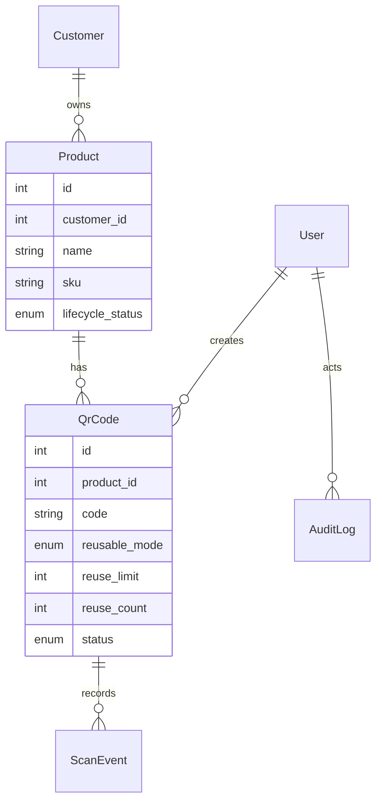

# QR Lifecycle Platform

Production-ready template for managing customers, products, artistic QR codes and their lifecycle analytics.

## Quick start

```bash
cp .env.example .env
docker compose up -d --build
```

Run migrations and seed data:

```bash
docker compose exec api alembic upgrade head
docker compose exec api python -c "from src.models.database import SessionLocal; from src.utils.seed import seed; db=SessionLocal(); seed(db); db.close()"
```

Default admin login: `admin@example.com` / `admin123`.

## Architecture

- **Backend:** FastAPI + SQLAlchemy + Alembic (Python 3.11)
- **Frontend:** React + Vite + TypeScript + Tailwind + shadcn-inspired components
- **Database:** PostgreSQL (managed via docker-compose)
- **Cache:** Redis (rate limiting, counters)
- **Containers:** `docker-compose.yml` orchestrates API, web, db, redis, pgAdmin
- **Storage:** Local `/uploads` directory via pluggable storage abstraction

## ERD



## API Highlights

- JWT auth with access/refresh tokens and RBAC (admin, staff)
- CRUD for customers, products, QR codes
- Artistic QR generation with optional mask image and color controls
- Public scan endpoint `/api/events/s/{code}` logs analytics, enforces reuse rules and lifecycle phases
- Analytics endpoints summarise activity and per-QR timelines

## Frontend Screens


_Use the included Tailwind + shadcn-inspired components to expand the UI._

## Tests & Quality

- Python tests: `pytest`
- Linting: `ruff`, `black`
- Frontend linting: configure via ESLint/Prettier if desired

### GitHub Actions

See `.github/workflows/ci.yml` for automated lint + test run.

## Future Work

- Swap `LocalStorage` with an S3-backed implementation (use `boto3` and configure bucket, prefix and presigned URLs).
- Front CDN (CloudFront/Fastly) in front of the S3 bucket for low-latency QR asset delivery.
- Implement Redis-backed rate limiting middleware for `/api/events/s/{code}`.
- Expand unit tests for mask rendering and CSV import.
- Add full-featured analytics dashboards and maps on the frontend.

## License

MIT
